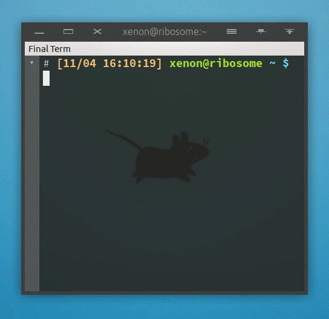

# Simplecolor-GaojiBlack / 简色高级黑

## Demo

## Changelog / 更新日志

*   **1.2**

    Make `prelight` icon backgrounds colorful, and color tweaks for Hide and
    Menu icons.

    让按钮悬浮样式更多彩; 调整了最小化和显示菜单按钮的对应颜色.

*   **1.1**

    Added `prelight` and `toggled` (for Stick and Shade) styles for buttons.

    为按钮增加指针悬浮样式, 为个别按钮 (在所有工作区显示和折叠内容) 增加激活样式.

*   **1.0**

    Initial version

    最初版本

<!-- vim:set ai et ts=4 sw=4 sts=4 fenc=utf-8: -->
